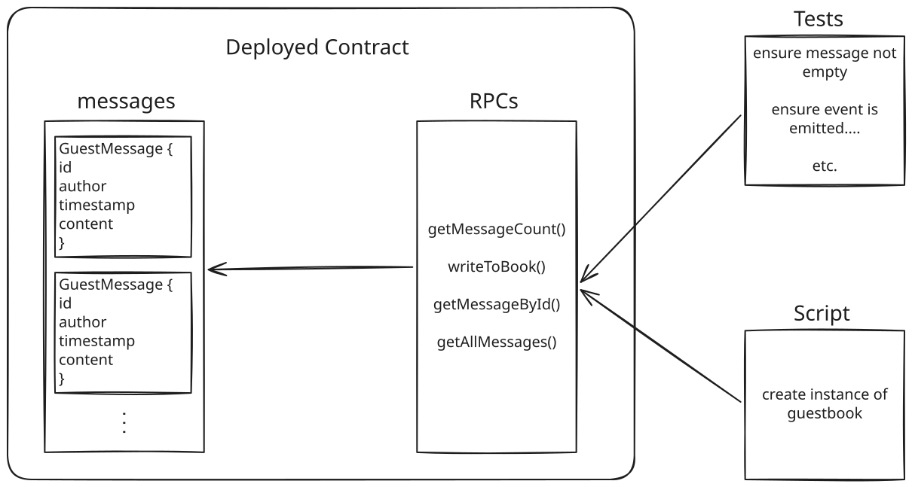

Hello! I'm Akshay. This readme serves to explain the technical reasoning behind this project.

I made a demo video where I explain my reasoning behind the tech stack chosen for this, if you prefer to watch a quick 2 min video rather than reading a bunch of text!
[Watch it on YouTube](https://youtu.be/bvddaoxwsJs)

This is my first time writing solidity, so i went ahead with a simple app.
This is supposed to be a Guestbook app where people can leave messages to be posted on a wall

The core idea is you have to sign in with your wallet to be able to post messages, so it has a service to connect your wallet,
after that you are able to post messages for everyone to see

There is a live contract that has been deployed on the sepolia testnet, and you need a sepolia account to be able to interact with this

Once you type out a message you're able to send the message to the smart contract which then after paying gas fees gets stored onto the shared state of the current guestbook
Each message has an author address, content, and timestamp. You use the RPCs to interact with the message 'database'



There's also a live deployment if you want to just try it out directly: https://subvisual.akshaykripalani.com/


# My reasoning

A smart contract is pretty much the same as an API, except instead of a dedicated database you just have the blockchain as your shared state. So in this case the shared state is an array of messages, and you mutate it by calling the rpc contract functions.

Each message is a struct with four fields:
1. `author` - the wallet address of whoever posted it
2. `content` - the message itself
3. `timestamp` - when it was posted
4. `id` - a monotonically increasing number


## Contract functions

1. `writeToBook()` - the write RPC. you need to be signed in with your wallet to call this, and you pay gas fees for it
2. `getAllMessages()` - read function, used by the frontend to load all messages
3. `getMessage()` - individual lookup, there for just the local testing aspect of it
4. `getMessageById` - same as above, used only in the anvil local testing env

One thing I learned while building this is that events are how you do interrupt-style architecture on the blockchain. Instead of polling to check if something happened, you emit an event and subscribers get notified. So rather than polling the chain you listen for this

## Tests

There are 8 tests covering things like:
- making sure empty messages get rejected
- ensuring an event is emitted on every write
- fuzz testing for invalid id checks
- etc.


# Tech Stack
1. Solidity
2. Foundry - For local blockchain and testing
3. Nextjs - Frontend, rainbowkit has very good support for it, so easy choice.
4. Rainbowkit - Wallet connection and auth. I figured this was the fastest way to get set up with wallet connection.
5. Wagmi - React hooks. Seems to be the standard library that everyone uses. Also pretty neat to interact with might i say!
6. Viem - Handled by wagmi for ABI interaction

how to run locally without any contract interactions:
```
docker run -it --rm node:22 bash
apt update
curl -L https://foundry.paradigm.xyz | bash
source ~/.bashrc
foundryup
git clone https://github.com/akshaykripalani/subvisual-academy
cd subvisual-academy
git submodule update --init --recursive
forge test
```

in another terminal (use docker ps and -it bash):
```
anvil
```


(since anvil provides a default first pk and contact address, export those)

back in origianl terminal:

```
export PRIVATE_KEY=0xac0974bec39a17e36ba4a6b4d238ff944bacb478cbed5efcae784d7bf4f2ff80
export RPC_URL=http://127.0.0.1:8545
export CONTRACT_ADDRESS=0x5FbDB2315678afecb367f032d93F642f64180aa3

forge script script/Guestbook.s.sol:GuestbookScript \
  --rpc-url $RPC_URL \
  --broadcast \
  --private-key $PRIVATE_KEY
```


Test commands:
1. Get total Message count
```
cast call $CONTRACT_ADDRESS \
  "getMessageCount()(uint256)" \
  --rpc-url $RPC_URL
```

2. Send a message
```
cast send $CONTRACT_ADDRESS \
  "writeToBook(string)" "hello from my cli" \
  --rpc-url $RPC_URL \
  --private-key $PRIVATE_KEY
```

3. Read message
```
cast call $CONTRACT_ADDRESS \
  "getMessageById(uint256)((uint256,address,uint256,string))" 1 \
  --rpc-url $RPC_URL
```

To run frontend:
```
cd frontend/subvisual-frontend
npm install
echo "NEXT_PUBLIC_CONTRACT_ADDRESS=$CONTRACT_ADDRESS" > /.env.local
npm run dev
```